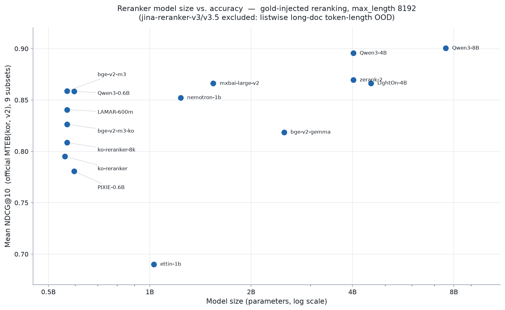

# Make Reranker Benchmark Simple Again
## Purpose
* 본 프로젝트는 Reranker Benchmark Evaluation을 최소한의 의존성으로 경량화하여, 누구나 쉽게 실행하고 즉각적인 결과를 얻을 수 있도록 설계되었습니다.

## Plan
* 본 프로젝트에서는 BM25 기반의 Stage 1 Retrieval을 통해 각 벤치마크 query 당 retrieval corpus를 1000개로 제한합니다. 각 query에 대한 정답 문서 정보를 포함하여, BM25 기준 상위 1000개 문서의 ID를 저장합니다.
* 이후 각 query 당 Top-k 50개의 corpus id를 활용하여, Stage 2 Reranking을 진행합니다.

## Results
### Stage 1 Retrieval
최적의 성능을 보여주는 한국어 tokenizer를 선정하기 위해 tokenizer별 평가를 진행하였습니다. 
#### Evaluation Code
```bash
# BM25 Stage 1 검색 (query 당 top-1000, 정답 문서 포함). 토크나이저는 Mecab/Kiwi/Okt/Kkma 중 선택.
uv run python eval/retrieve_stage1_bm25.py --tokenizer Mecab --datasets all

# 공식 MTEB(kor, v2) 기준 task 마이닝 (mteb 2.x, 표준 eval_splits, 예: MLDR=dev+test):
uv run python eval/retrieve_stage1_bm25.py --tokenizer Mecab --kor_tasks MultiLongDocRetrieval LawIRKo
```
#### Leaderboard
```bash
cd eval
uv run streamlit run leaderboard_bm25.py
```
#### Results
| Model | Average Recall@10 | Average Precision@10 | Average NDCG@10 | Average F1@10 |
|-------|----------------|-------------------|--------------|------------|
| Mecab | **0.8731**     | 0.1000            | 0.7433       | **0.1783** |
| Okt   | 0.8655         | **0.1001**        | **0.7474**   | 0.1783     |
| Kkma  | 0.8504         | 0.0982            | 0.7358       | 0.1749     |
| Kiwi  | 0.8443         | 0.0961            | 0.7210       | 0.1715     |

top-k 10에서 가장 높은 성능을 보인 **Mecab** tokenizer를 사용하여, Stage 1 Retrieval을 진행하였습니다.

### Stage 2 Reranking
#### Benchmark Datasets
**공식 [MTEB(kor, v2)](https://github.com/embeddings-benchmark/mteb) 의 9개 Korean Retrieval 벤치마크** (총 12,054 queries)에 대한 평가를 진행하였습니다. 각 task 는 MTEB 표준 `eval_splits` 를 그대로 사용합니다 (예: MLDR = dev+test 평균, MIRACL/Ko-StrategyQA = dev, 그 외 = test).

| 데이터셋 | 설명 | split | queries |
|---|---|---|---|
| [Ko-StrategyQA](https://huggingface.co/datasets/taeminlee/Ko-StrategyQA) | 한국어 ODQA multi-hop 검색 (StrategyQA 번역) | dev | 592 |
| [AutoRAGRetrieval](https://huggingface.co/datasets/yjoonjang/markers_bm) | 금융·공공·의료·법률·커머스 5개 분야 문서 검색 | test | 114 |
| [MIRACLRetrieval](https://huggingface.co/datasets/miracl/miracl) | Wikipedia 기반 한국어 문서 검색 | dev | 213 |
| [PublicHealthQA](https://huggingface.co/datasets/xhluca/publichealth-qa) | 의료·공중보건 도메인 문서 검색 | test | 77 |
| [BelebeleRetrieval](https://huggingface.co/datasets/facebook/belebele) | FLORES-200 기반 한국어 문서 검색 (kor subset) | test | 900 |
| [MrTidyRetrieval](https://huggingface.co/datasets/mteb/mrtidy) | Wikipedia 기반 한국어 문서 검색 | test | 421 |
| [MultiLongDocRetrieval](https://huggingface.co/datasets/Shitao/MLDR) | 다양한 도메인 한국어 **장문** 검색 | dev+test | 400 |
| [SQuADKorV1Retrieval](https://huggingface.co/datasets/yjoonjang/squad_kor_v1) | 한국어 SQuAD v1.0 기반 검색 | test | 5,774 |
| LawIRKo | 한국어 법률 정보 검색 | test | 3,563 |

> **Note**: 기존 XPQARetrieval·WebFAQRetrieval 은 공식 MTEB(kor, v2) subset 이 아니므로 제외하고, 공식 task 인 LawIRKo 를 추가하여 공식 벤치마크와 정합시켰습니다. SQuADKorV1Retrieval 등 일부 task 는 `eval/custom_mteb_tasks.py` 에 MTEB Task 클래스로 구현되어 있습니다.

#### Evaluation Code
Stage 2 reranking 은 **정답(gold) 문서를 재랭킹 후보에 항상 포함**시키는 방식으로 평가합니다 (아래 *Methodology* 참고).
```bash
# 공식 9개 데이터셋 전부 평가 (DEFAULT_TASKS)
uv run python eval/evaluate_reranker.py \
	--model_names BAAI/bge-reranker-v2-m3 \
	--gpu_id 0 \
	--batch_size 8

# 또는 특정 데이터셋만 선택
uv run python eval/evaluate_reranker.py \
	--model_names "my_reranker_model" \
	--tasks Ko-StrategyQA AutoRAGRetrieval SQuADKorV1Retrieval LawIRKo \
	--gpu_id 0 \
	--batch_size 8
```

#### Leaderboard
```bash
cd eval
uv run streamlit run leaderboard_reranker.py
```

#### Methodology
- **Gold-injected reranking (올바른 재랭킹 평가)**: 각 query 의 **정답(gold) 문서를 재랭킹 후보 집합에 항상 포함**시킨 뒤 (후보 = BM25 top-50 ∪ gold) reranker 로 재랭킹합니다. BM25 가 정답을 top-50 안에 놓치더라도 reranker 의 순수 랭킹 품질을 측정하기 위함입니다.
- **채점**: [mteb](https://github.com/embeddings-benchmark/mteb) **2.x** 의 공식 채점(`TaskResult.get_score`, eval_splits·subset 평균)을 사용합니다.
- **최대 시퀀스 길이 (max_length)**: **모든 모델을 `max_length=8192` 로 측정**합니다. 단, **아키텍처상 8192 를 지원하지 않는 모델은 네이티브 최대 길이로 측정**합니다 — **`Dongjin-kr/ko-reranker` = 512** (XLM-RoBERTa 계열, max position 514), `cross-encoder/ettin-reranker-1b-v1` = 7999. 각 결과 파일(`eval/results/stage2_mteb2x/<model>/<task>.json`)에 실제 적용된 `_max_length` 가 기록됩니다.
- **후보 깊이**: gold 외 BM25 top-50 negative (`_neg_top_k=50`).

**모델 크기 vs. 성능 (9-subset)** — x축 파라미터 수(log), y축 9-subset mean NDCG@10. jina-reranker-v3/v3.5 는 제외.



#### Results — Official kMTEB (9 subsets)
**공식 9개 subset 을 모두 평가한 모델**의 mean NDCG@1/5/10 (NDCG@10 내림차순). listwise 모델처럼 장문(MLDR)을 완료하지 못한 모델은 아래 **8-subset 표**에서 공정 비교합니다.

| Model | Params | Mean NDCG@1 | Mean NDCG@5 | Mean NDCG@10 |
|---|---|---|---|---|
| tomaarsen/Qwen3-Reranker-8B-seq-cls | 7.6B | 0.8316 | 0.8871 | 0.9004 |
| tomaarsen/Qwen3-Reranker-4B-seq-cls | 4.0B | 0.8251 | 0.8812 | 0.8956 |
| zeroentropy/zerank-2-reranker | 4.0B | 0.7803 | 0.8524 | 0.8695 |
| lightonai/LightOn-rerank-PW-4B | 4.5B | 0.7798 | 0.8513 | 0.8664 |
| mixedbread-ai/mxbai-rerank-large-v2 | 1.5B | 0.7860 | 0.8474 | 0.8661 |
| BAAI/bge-reranker-v2-m3 | 568M | 0.7682 | 0.8414 | 0.8586 |
| tomaarsen/Qwen3-Reranker-0.6B-seq-cls | 596M | 0.7708 | 0.8435 | 0.8585 |
| nvidia/llama-nemotron-rerank-1b-v2 | 1.2B | 0.7693 | 0.8354 | 0.8522 |
| nlpai-lab/LAMAR-600m | 568M | 0.7509 | 0.8240 | 0.8406 |
| dragonkue/bge-reranker-v2-m3-ko | 568M | 0.7281 | 0.8060 | 0.8263 |
| BAAI/bge-reranker-v2-gemma | 2.5B | 0.7383 | 0.8007 | 0.8186 |
| upskyy/ko-reranker-8k | 568M | 0.6906 | 0.7883 | 0.8085 |
| Dongjin-kr/ko-reranker | 560M | 0.6866 | 0.7748 | 0.7950 |
| telepix/PIXIE-Spell-Reranker-Preview-0.6B | 596M | 0.6927 | 0.7599 | 0.7806 |
| cross-encoder/ettin-reranker-1b-v1 | 1.0B | 0.5686 | 0.6605 | 0.6901 |

> `jinaai/jina-reranker-v3` 와 `jinaai/jina-reranker-v3.5` 는 **listwise** reranker 로, 장문(`MultiLongDocRetrieval`)에서 다른 모델과 **동일 조건(8192)으로 공정 비교가 불가능**하여 두 모델 모두 MLDR 을 N/A 로 두고 위 9-subset 평가에서 제외합니다. 실제 후보셋(정답 ∪ BM25 top-50 ≈ 51개, 문서 토큰 길이 mean ≈ 8000)을 8192 로 재랭킹하면 51개가 단일 컨텍스트에 들어가지 않아 블록으로 분할되는데, **블록을 키우면 OOM**(80GB GPU 에서도 첫 블록 ≈ 126k 토큰), **블록을 줄이면**(예: 블록당 2문서) jina 의 listwise 상호작용이 사실상 사라져 pointwise 에 가까워지고 점수가 임의의 블록 크기(다른 모델엔 없는 노브)에 의존하게 됩니다. 즉 장문 task 는 listwise reranker 의 **token-length OOD** 로 공정 측정이 원천적으로 어렵습니다. 아래 8-subset 표에서 비교하세요.

#### Results — MLDR 제외 (8 subsets · listwise / long-doc OOD 공정 비교)
장문(`MultiLongDocRetrieval`)을 제외한 **8개 공통 subset** 기준 mean NDCG@1/5/10 (NDCG@10 내림차순). listwise 모델(`jina-reranker-v3`, `jina-reranker-v3.5`)을 포함해 **모든 모델을 동일 기준으로 비교**합니다. (MLDR 이 가장 어려운 task 라 전 모델의 mean 이 9-subset 대비 상승합니다 — 표 간 절대값 비교 금지.)

| Model | Params | Mean NDCG@1 | Mean NDCG@5 | Mean NDCG@10 |
|---|---|---|---|---|
| tomaarsen/Qwen3-Reranker-8B-seq-cls | 7.6B | 0.8424 | 0.8966 | 0.9102 |
| tomaarsen/Qwen3-Reranker-4B-seq-cls | 4.0B | 0.8373 | 0.8918 | 0.9062 |
| jinaai/jina-reranker-v3.5 | 597M | 0.8145 | 0.8777 | 0.8924 |
| mixedbread-ai/mxbai-rerank-large-v2 | 1.5B | 0.8149 | 0.8718 | 0.8896 |
| zeroentropy/zerank-2-reranker | 4.0B | 0.8066 | 0.8735 | 0.8891 |
| jinaai/jina-reranker-v3 | 597M | 0.8049 | 0.8703 | 0.8867 |
| BAAI/bge-reranker-v2-gemma | 2.5B | 0.8099 | 0.8688 | 0.8850 |
| BAAI/bge-reranker-v2-m3 | 568M | 0.7965 | 0.8659 | 0.8824 |
| lightonai/LightOn-rerank-PW-4B | 4.5B | 0.7966 | 0.8644 | 0.8796 |
| nvidia/llama-nemotron-rerank-1b-v2 | 1.2B | 0.7967 | 0.8582 | 0.8748 |
| nlpai-lab/LAMAR-600m | 568M | 0.7942 | 0.8597 | 0.8747 |
| tomaarsen/Qwen3-Reranker-0.6B-seq-cls | 596M | 0.7803 | 0.8526 | 0.8682 |
| telepix/PIXIE-Spell-Reranker-Preview-0.6B | 596M | 0.7730 | 0.8364 | 0.8553 |
| Dongjin-kr/ko-reranker | 560M | 0.7433 | 0.8299 | 0.8479 |
| dragonkue/bge-reranker-v2-m3-ko | 568M | 0.7429 | 0.8211 | 0.8414 |
| upskyy/ko-reranker-8k | 568M | 0.7210 | 0.8160 | 0.8348 |
| cross-encoder/ettin-reranker-1b-v1 | 1.0B | 0.6138 | 0.7034 | 0.7307 |

#### Per-dataset NDCG@10

| Model | Params | Ko-StrategyQA | AutoRAGRetrieval | PublicHealthQA | BelebeleRetrieval | MIRACLRetrieval | MrTidyRetrieval | MultiLongDocRetrieval | SQuADKorV1Retrieval | LawIRKo |
|---|---|---|---|---|---|---|---|---|---|---|
| tomaarsen/Qwen3-Reranker-8B-seq-cls | 7.6B | 0.8679 | 0.9546 | 0.8893 | 0.9907 | 0.8490 | 0.8409 | 0.8220 | 0.9880 | 0.9014 |
| tomaarsen/Qwen3-Reranker-4B-seq-cls | 4.0B | 0.8733 | 0.9707 | 0.8685 | 0.9906 | 0.8533 | 0.8321 | 0.8105 | 0.9861 | 0.8752 |
| jinaai/jina-reranker-v3.5 | 597M | 0.8539 | 0.9838 | 0.8094 | 0.9733 | 0.8565 | 0.8194 | — | 0.9887 | 0.8545 |
| jinaai/jina-reranker-v3 | 597M | 0.8553 | 0.9773 | 0.7960 | 0.9695 | 0.8449 | 0.8104 | — | 0.9859 | 0.8546 |
| zeroentropy/zerank-2-reranker | 4.0B | 0.8712 | 0.9436 | 0.8646 | 0.9846 | 0.8003 | 0.8027 | 0.7120 | 0.9791 | 0.8669 |
| lightonai/LightOn-rerank-PW-4B | 4.5B | 0.8567 | 0.9321 | 0.8693 | 0.9882 | 0.8072 | 0.8091 | 0.7609 | 0.9803 | 0.7938 |
| mixedbread-ai/mxbai-rerank-large-v2 | 1.5B | 0.8563 | 0.9531 | 0.8772 | 0.9778 | 0.7939 | 0.8771 | 0.6787 | 0.9681 | 0.8130 |
| BAAI/bge-reranker-v2-m3 | 568M | 0.8487 | 0.9663 | 0.8475 | 0.9853 | 0.8129 | 0.8222 | 0.6690 | 0.9853 | 0.7906 |
| tomaarsen/Qwen3-Reranker-0.6B-seq-cls | 596M | 0.8336 | 0.9308 | 0.8489 | 0.9779 | 0.8507 | 0.7359 | 0.7813 | 0.9808 | 0.7867 |
| nvidia/llama-nemotron-rerank-1b-v2 | 1.2B | 0.8536 | 0.9480 | 0.8491 | 0.9883 | 0.8182 | 0.8026 | 0.6719 | 0.9858 | 0.7527 |
| nlpai-lab/LAMAR-600m | 568M | 0.8461 | 0.9591 | 0.8225 | 0.9835 | 0.8214 | 0.7975 | 0.5679 | 0.9850 | 0.7822 |
| dragonkue/bge-reranker-v2-m3-ko | 568M | 0.8232 | 0.9684 | 0.8708 | 0.9769 | 0.7573 | 0.6776 | 0.7061 | 0.9846 | 0.6721 |
| BAAI/bge-reranker-v2-gemma | 2.5B | 0.8614 | 0.9407 | 0.8698 | 0.9857 | 0.8362 | 0.8429 | 0.2881 | 0.9858 | 0.7572 |
| upskyy/ko-reranker-8k | 568M | 0.8143 | 0.9230 | 0.8388 | 0.9291 | 0.7249 | 0.6998 | 0.5975 | 0.9718 | 0.7770 |
| Dongjin-kr/ko-reranker | 560M | 0.8468 | 0.9014 | 0.7675 | 0.9759 | 0.8017 | 0.7772 | 0.3721 | 0.9785 | 0.7343 |
| telepix/PIXIE-Spell-Reranker-Preview-0.6B | 596M | 0.8329 | 0.9794 | 0.8534 | 0.9777 | 0.8449 | 0.7650 | 0.1829 | 0.9850 | 0.6042 |
| cross-encoder/ettin-reranker-1b-v1 | 1.0B | 0.6624 | 0.8901 | 0.7461 | 0.6914 | 0.7004 | 0.6659 | 0.3651 | 0.9590 | 0.5306 |

> **Notes**
> - **max_length**: 위 *Methodology* 참고 — 전 모델 8192, `Dongjin-kr/ko-reranker` 는 512, `ettin` 은 7999.
> - **제외 모델 (3)**: `sigridjineth/ko-reranker-v1.1`, `Alibaba-NLP/gte-multilingual-reranker-base`, `jinaai/jina-reranker-v2-base-multilingual` 은 통합 env(transformers 5.x)에서 아키텍처 비호환(RoPE device-side assert 등)으로 실행 불가하여 제외했습니다.
> - **일부 재사용**: 정답이 항상 BM25 top-50 안에 있어 gold-injection 이 무의미한 단일 subset·단일 split no-op task(AutoRAG/Ko-StrategyQA/SQuAD)의 경우, 4개 모델(PIXIE·Qwen-8B·upskyy·mxbai)은 MrTidy Δ<0.01 로 검증한 뒤 mteb 1.38 원본 점수를 재사용했고, 나머지 모델은 8192 로 재실행했습니다.

<!-- ## Contributions

This project welcomes contributions and suggestions. See [issues](https://github.com/instructkr/retriever-simple-benchmark/issues) if you consider doing any.

When you submit a pull request, please make sure that you should run formatter by `make format && make check`, please. -->
